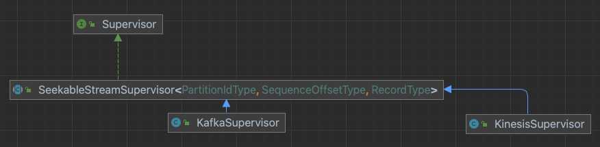
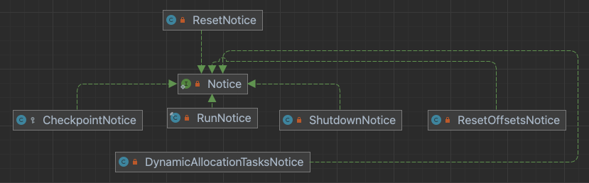
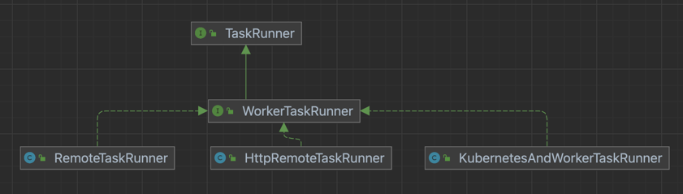
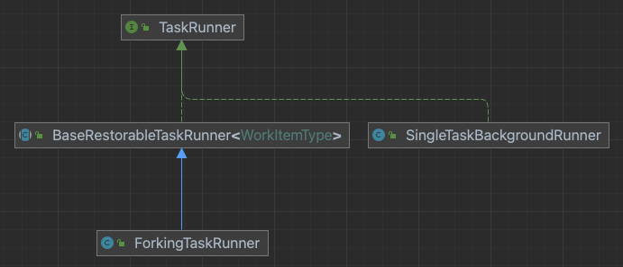
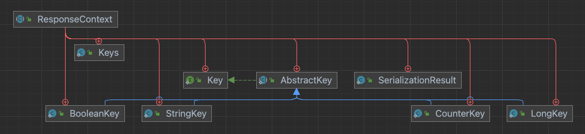
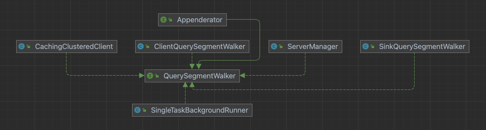

# 数据段

**标识符**

`segmentId` 是一个数据段的唯一标识。`dataSource` + `interval` + `version` + `partitionNum` 组成。

```java
public final class SegmentId implements Comparable<SegmentId>
{
  private static final Interner<String> STRING_INTERNER = Interners.newWeakInterner();
  
  private static final Interner<Interval> INTERVAL_INTERNER = Interners.newWeakInterner();
  
  private SegmentId(String dataSource, Interval interval, String version, int partitionNum)
  {
    this.dataSource = STRING_INTERNER.intern(Objects.requireNonNull(dataSource));
    this.interval = INTERVAL_INTERNER.intern(Objects.requireNonNull(interval));
    this.version = Objects.requireNonNull(version);
    this.partitionNum = partitionNum;
    this.hashCode = computeHashCode();
  }
}
```

该类必须优化常驻内存，因为段数据会在 `broker` 和 `coordinator` 消耗大量的堆内存。`Interners` 确保相同的内容使用同一个对象，会维护一个应用级别的常量池，且通过弱引用存储在一个集合中，没有其他引用时，会被垃圾回收。

# 版本系统

段版本和段间隔相关，相同间隔内的所有可见段应有相同的版本。若同一间隔内有多个不同版本的段，较低版本会被较高版本覆盖，在集群中不可见。由 `VersionedIntervalTimeline` 实现，用于查找给定间隔内最高版本的段。

`Overshadowable` 表示实例间有覆盖关系。如果一个 `Overshadowable` 的根分区范围包含另一个 `Overshadowable` 的根分区范围，且有更高的 `MinorVersion`，则可以覆盖。一个 `Overshadowable` 的分区范围是连续的才能被覆盖。

# 压缩

段的大小很重要，如果太小会产生太多线程，太大查询无法完全并行，段的大小不好评估，需要借助压缩。

`coordinator` 可定期运行压缩任务。一个压缩任务读取一批段，必要时会写入新的段。压缩任务必须支持段原子更新，在相同间隔内，新段和旧段随时可见。压缩任务不能阻塞摄取任务。

段的原子更新用版本系统实现，相同的间隔，新的段版本要高于旧的段。如果压缩任务和摄取任务同时向已有的数据源添加数据，压缩任务增加段版本，摄取任务产生的段会被覆盖。

需要新的机制，只覆盖压缩前的段，用锁解决。

# Zookeeper路径

`druid` 用 `zookeeper` 管理集群的状态。需要使用 `zookeeper` 的操作：`master` 节点 `leader` 选举；`historical` 通知加载的段；任务管理；`coordinator` 和 `historical` 交互，处理段加载/删除。

使用的路径：

- `/druid/internal-discovery/NodeRole/`：节点加入集群，宣布到集群；
- `/druid/coordinator/_COORDINATOR`：用于 `coordinator` 做 `leader` 选举，是临时节点，客户端断开连接会删除；

# Supervisor管理

`SupervisorManager` 维护 `supervisor`。首次启动从元数据库加载所有的 `SupervisorSpec`，创建并执行。

# Supervisor运行

流任务创建和数据源分区发现是由 `supervisor` 管理的。一个 `TaskGroup` 对应一个任务，用来组织任务、管理消费的分区，消费相同分区的 `TaskGroup` 组ID相同。



重要数据结构：

```java
//<groupId, TaskGroup>，reading的TaskGroup
private final ConcurrentHashMap<Integer, TaskGroup> activelyReadingTaskGroups = new ConcurrentHashMap<>();

//<groupId, TaskGroup>，publishing的TaskGroup
private final ConcurrentHashMap<Integer, CopyOnWriteArrayList<TaskGroup>> pendingCompletionTaskGroups = new ConcurrentHashMap<>();

//每个分区当前消费到的偏移量，初始化或任务失败置为-1
protected final ConcurrentHashMap<PartitionIdType, SequenceOffsetType> partitionOffsets = new ConcurrentHashMap<>();

//每个组ID消费的分区
protected final ConcurrentHashMap<Integer, Set<PartitionIdType>> partitionGroups = new ConcurrentHashMap<>();

//发现的分区ID
protected final List<PartitionIdType> partitionIds = new CopyOnWriteArrayList<>();
```

线程池：

```java
//处理队列中的notice
this.exec = Execs.singleThreaded(StringUtils.encodeForFormat(supervisorId));

this.scheduledExec = Execs.scheduledSingleThreaded(StringUtils.encodeForFormat(supervisorId) + "-Scheduler-%d");

this.reportingExec = Execs.scheduledSingleThreaded(StringUtils.encodeForFormat(supervisorId) + "-Reporting-%d");

this.workerExec = MoreExecutors.listeningDecorator(
    Execs.multiThreaded(
        workerThreads,
        StringUtils.encodeForFormat(supervisorId) + "-Worker-%d"
    )
);
```

创建消费者后处理 `notice`，每个 `notice` 表示几个执行步骤。



`supervisor` 运行后，会依次执行队列中的 `Notice`。`supervisor` 的状态：

```java
public enum SeekableStreamState implements State
{
  UNABLE_TO_CONNECT_TO_STREAM(false, true),
  LOST_CONTACT_WITH_STREAM(false, false),

  CONNECTING_TO_STREAM(true, true),
  DISCOVERING_INITIAL_TASKS(true, true),
  CREATING_TASKS(true, true);

  private final boolean healthy;
  private final boolean firstRunOnly;

  SeekableStreamState(boolean healthy, boolean firstRunOnly)
  {
    this.healthy = healthy;
    this.firstRunOnly = firstRunOnly;
  }
}
```

`RunNotice` 负责数据源分区发现，任务创建。

首次启动创建一个 `WorkerTaskRunner` 的 `listener`，若有任务状态变化，添加一个 `RunNotice` 到队列。

`supervisor` 状态置为 `CONNECTING_TO_STREAM`，更新分区视图。从流获取最新分区更新 `partitionIds` 和 `partitionGroups`，用分区号和任务数计算组ID。若是新分区，`partitionOffsets` 置为-1。若分区数减少，对 `kafka` 一定是重建了 `topic`，消费者定位到最小的偏移量；若分区数增加，提前发出信号终止 `reading` 的任务组，重新分配分区，分区更新结束。

`supervisor` 状态置为 `DISCOVERING_INITIAL_TASKS`，更新任务视图。遍历元数据库中活跃的任务及消费的分区，通过分区号获得任务对应的任务组。通过 `http` 获取任务的状态，若为 `publishing` 会返回 `endOffsets`，用 `endOffsets` 更新 `partitionOffsets`；若为 `reading`，检查任务和 `supervisor` 配置的匹配度。同时更新对应的任务组。

通过 `http` 获取发现的任务的 `checkpoints`，从元数据库获取各分区的偏移量，合并 `checkpoints` 只保留大于和元数据库匹配的版本。

更新 `supervisor` 视角任务的状态，通过 `http` 获取任务开始时间，任务状态从元数据库同步。

若分区变化收到提前终止信号或任务执行时间已耗尽，执行 `checkpoint`。先通过 `http` 暂停任务，设置 `endOffsets` 为任务当前消费的分区偏移量，发送 `setEndOffsets` 请求到任务。

`checkpoint` 完毕，设置任务组的 `completionTimeout`。将 `endOffsets` 更新到 `partitionOffsets` 作为下次消费的起点。

检查任务组的状态， `publishing` 的任务组，若在 `completionTimeout` 内没有完成，杀死任务，`partitionOffsets` 置为-1；`reading` 的任务组，检查任务和 `supervisor` 配置的匹配度。

发现已有任务后，若任务数不足则创建任务，状态置为 `CREATING_TASKS`。创建任务前先合并 `checkpoints`，确保新任务读到最新的。确保每个分区都有任务组消费，偏移量为-1从元数据库获取，元数据库为空从流获取。若任务组的任务数不足副本数，则创建 `TaskSpec` 生成任务ID，提交给 `TaskQueue`。

# 添加任务到队列

`TaskQueue` 接受任务创建者提交的任务，这里的任务会以 `FIFO` 的方式提交。

`TaskQueue` 的重要数据结构：

```java
//记录所有任务，已提交、正在运行或已完成的
@GuardedBy("giant")
private final LinkedHashMap<String, Task> tasks = new LinkedHashMap<>();

//每个任务的future
@GuardedBy("giant")
private final Map<String, ListenableFuture<TaskStatus>> taskFutures = new HashMap<>();

//已完成等待被清理的任务，这些任务不应再被提交
@GuardedBy("giant")
private final Set<String> recentlyCompletedTasks = new HashSet<>();
```

线程池：

```java
this.taskCompleteCallbackExecutor = Execs.multiThreaded(
    config.getTaskCompleteHandlerNumThreads(),
    "TaskQueue-OnComplete-%d"
); //任务完成后执行回调，设计数据库更新和同步调用，用独立的线程池避免影响工作线程

this.managerExec = Executors.newSingleThreadExecutor(
      new ThreadFactoryBuilder()
          .setDaemon(false)
          .setNameFormat("TaskQueue-Manager").build()
); //提交任务运行

this.storageSyncExec = Executors.newSingleThreadScheduledExecutor(
      new ThreadFactoryBuilder()
          .setDaemon(false)
          .setNameFormat("TaskQueue-StorageSync").build()
); //同步元数据
```

同步元数据，以元数据库活跃的任务为准，包括 `pending` 或 `running` 的任务，更新 `tasks` 。

添加任务，为任务设置一些 `context`，元数据库添加该任务信息，状态初始化为 `RUNNING`。

提交任务运行，遍历 `tasks`，忽略 `recentlyCompletedTasks` 中已经完成的任务。若任务状态为 `PENDING`，交给 `WorkerTaskRunner` 提交，创建 `future` 等待任务完成。

任务完成后会执行一些回调，添加到 `recentlyCompletedTasks`。从 `WorkerTaskRunner` 获取任务位置，将状态和位置更新到元数据库，元数据库中任务的位置在任务完成后才会更新。更新完毕，调用 `WorkerTaskRunner` 终止任务后，清除该任务的信息。

`TaskQueue` 作为任务提交的入口，维护了当前任务的状态，并提供了方法获取这些状态。

# 提交任务到Worker

`overlord` 分配任务到 `worker` 运行，该过程由 `WorkerTaskRunner` 控制。



配置 `druid.indexer.runner.type` 控制使用的实现类，默认选择 `httpRemote`。`RemoteTaskRunner` 通过 `zookeeper` 同步 `worker` 和任务的状态，由于依赖多状态同步会有延迟，已不推荐使用。`HttpRemoteTaskRunner` 通过 `zookeeper` 发现服务，用 `http` 请求发现状态，目前为默认配置。

`HttpRemoteTaskRunner` 的重要数据结构：

```java
//记录所有已知的任务
@GuardedBy("statusLock")
private final ConcurrentMap<String, HttpRemoteTaskRunnerWorkItem> tasks = new ConcurrentHashMap<>();

//pending任务列表
private final List<String> pendingTaskIds = new ArrayList<>();

//已发现的worker
private final ConcurrentMap<String, WorkerHolder> workers = new ConcurrentHashMap<>();

//任务多次失败的worker，加入黑名单列表
private final ConcurrentHashMap<String, WorkerHolder> blackListedWorkers = new ConcurrentHashMap<>();

//已经分配任务的worker，但还未确认，<workerId, taskId>
@GuardedBy("statusLock")
private final ConcurrentMap<String, String> workersWithUnacknowledgedTask = new ConcurrentHashMap<>();
```

 线程池：

```java
this.pendingTasksExec = Execs.multiThreaded(
    config.getPendingTasksRunnerNumThreads(),
    "hrtr-pending-tasks-runner-%d"
); //处理pending任务列表

this.workersSyncExec = ScheduledExecutors.fixed(
    config.getWorkerSyncNumThreads(),
    "HttpRemoteTaskRunner-worker-sync-%d"
); //同步worker状态

this.cleanupExec = MoreExecutors.listeningDecorator(
    ScheduledExecutors.fixed(1, "HttpRemoteTaskRunner-Worker-Cleanup-%d")
); //移除黑名单worker
```

通过内部发现，获取集群中活跃的 `worker`，创建 `listener` 监听 `worker` 及任务的状态。`WorkerTaskRunner` 视角的任务状态：

```java
enum State
{
  PENDING(0, true, RunnerTaskState.PENDING),
  PENDING_WORKER_ASSIGN(1, true, RunnerTaskState.PENDING),
  RUNNING(2, false, RunnerTaskState.RUNNING),
  COMPLETE(3, false, RunnerTaskState.NONE);

  private final int index;
  private final boolean isPending;
  private final RunnerTaskState runnerTaskState;
}
```

每当有新任务提交，先加入 `pendingTaskIds`，状态置为 `PENDING`。

定期处理 `pendingTaskIds`，按照给定策略寻找 `worker` 调度任务，确定好 `worker` 后，更新 `workersWithUnacknowledgedTask`，任务状态置为 `PENDING_WORKER_ASSIGN`，等待 `worker` 确认。发送请求到 `worker`，确认后将 `worker` 移出 `workersWithUnacknowledgedTask`，避免 `worker` 处理请求繁忙。

当 `listener` 监听到 `worker` 或任务状态变化时，若 `tasks` 没有该任务，从元数据库取其状态。比较 `WorkerTaskRunner` 和 `worker` 两段的任务状态是否匹配，根据 `worker` 侧的状态更新 `WorkerTaskRunner` 侧的状态，如果状态有歧义，比如 `WorkerTaskRunner` 端任务已经完成了，`worker` 端还在运行；两端运行的位置不一致；终止该任务。

`WorkerTaskRunner` 同步各个 `worker` 的状态，因此也管理着整个集群的 `slot` 使用情况，提供了一些方法获取这些信息。

# Worker创建任务

分配到 `worker` 上的任务由 `WorkerTaskManager` 创建管理，`peon` 位置变化通知 `overlord`。

`worker` 若发生过重启，会尝试恢复运行的任务。反序列化 `restore.json` 文件，找到每个任务对应的目录，创建任务。

`worker` 收到分配任务请求，将任务 `spec` 记录到 `assignedTasks` 目录，记录完毕则返回请求给 `overlord`。为保证写文件操作的原子性，先写到临时目录 `workerTaskManagerTmp`，再转移到 `assignedTasks`。

`ForkingTaskRunner` 负责创建 `peon` ，`SingleTaskBackgroundRunner` 执行 `peon` 的逻辑。



一个 `slot` 运行一个任务，`druid.worker.capacity` 配置 `slot` 数量，一个 `slot` 至少要分配一个处理器。每个 `slot` 对应一个目录，选择 `slot` 就是为任务选择目录，默认以轮询的方式选择没被使用的 `slot`。

任务启动前先创建需要的文件：`task.json`，保存任务的 `spec`；`status.json`，任务退出后，记录结束状态；`log`，记录任务输出的日志；`report.json`，记录任务写入的段信息。添加命令创建子进程，并监控其状态。任务创建后从 `assignedTasks` 移除，写入 `spec` 到 `restore.json`，以便崩溃后恢复。

# 流任务执行

为避免同一任务在相同机器执行多次，运行前先创建 `lock` 文件锁定目录。流任务的状态：

```java
public enum Status
{
  NOT_STARTED,
  STARTING,
  READING,
  PAUSED,
  PUBLISHING
}
```

重要数据结构：

```java
//分区消费进度
private volatile CopyOnWriteArrayList<SequenceMetadata<PartitionIdType, SequenceOffsetType>> sequences;

//任务结束时的offset，初始化为一个很大的值
private final Map<PartitionIdType, SequenceOffsetType> endOffsets;

//下次要读的偏移量
private final ConcurrentMap<PartitionIdType, SequenceOffsetType> currOffsets = new ConcurrentHashMap<>();
```

状态初始化为 `STARTING`。初始化序列，从 `context` 获取 `checkpoints`，反序列化失败，从 `ioConfig` 初始化序列。执行逻辑前，通过内部发现宣布任务。取 `sequences` 中的最小版本更新 `currOffsets`，状态置为 `READING` 开始消费数据。

用消费者拉取一批数据，添加每条记录到合适的段。找起始间隔小于记录时间戳的段。若找不到合适的段，请求 `overlord` 创建新段，宣布段的存在。解析记录的维度，添加到段中。若内存中数据条数大于 `maxRowsInMemory` ，持久化到磁盘，记录当前消费的偏移量。暂停任务，向 `supervisor` 提交 `checkpoint` 请求。

收到暂停请求后，状态置为 `PAUSED`；收到唤醒请求后，状态置为 `READING`。发生暂停后，可能任务需要终止，`endOffsets` 被更新，任务状态置为 `PUBLISHING`。

推送数据前，先把临时文件合并成段，合并指标维度和记录。数据发送到深度存储后更新元数据。等待段被 `handoff`，`coordinator` 加载段后，任务完成。更新的元数据包括 `druid_dataSource` 和 `druid_segments`。

# Segment生成

任务把数据写入新段，要向 `overlord` 发送请求申请新段。`SegmentAllocationQueue` 接收请求分配段。段的分配速度影响到任务的创建速度，`SegmentAllocationQueue` 按批处理请求，数据源和组相同的请求分到同一批，加入处理队列。

`SegmentAllocationQueue` 定期从队列取出一批请求处理，为每个请求分配段，若失败则重新加入队列，直到超时。在这之前，会先查询元数据库中间隔和请求有重叠的段，根据已存在的段间隔优化请求的间隔。

按间隔申请段，创建锁请求为任务申请锁后，分配段ID。时间块锁，先加锁再生成段ID；段锁，先生成段ID再加锁。为任务分配段，优先使用 `druid_pendingSegments` 中的段，没有可用的则为请求生成新的段ID，将任务占用锁的记录更新到元数据库，段分配成功。

# 任务锁

任务写段前要先获得锁。一个任务获取到锁，当任务结束或其他任务抢占后，该锁会失效。如果任务用相同的锁产生多个段，这些段应该有相同的版本。新锁的版本通常比旧锁高。任务锁会涉及到版本的分配。任务锁定一个间隔或一个新段，会被分配一个新版本用于发布段。任务锁定已存在的段，不需要分配新版本。

追加任务可用 `EXCLUSIVE`、`SHARED` 或 `APPEND` ；替代任务可用 `EXCLUSIVE` 或 `REPLACE`； `REPLACE` 和 `APPEND` 只能用于时间块锁。

```java
public enum TaskLockType
{
  //给定间隔内最多有一个活跃的EXCLUSIVE锁，和其他活跃的锁不能有重叠的间隔
  EXCLUSIVE,
	//给定间隔内可有任意数量的SHARED锁，不能与其他类型的锁共存
  SHARED,
	//给定间隔内最多有一个REPLACE锁，只能与APPEND锁共存，APPEND锁的间隔要在其范围内，其他范围的锁有重叠间隔无法共存
  REPLACE,
	//给定间隔可有多个APPEND锁，可与其他APPEND锁共存。最多与一个REPLACE锁共存，间隔要在其范围之内，与其他锁不兼容
  APPEND
}
```

锁的粒度分为时间块锁和段锁。

```java
public enum LockGranularity
{
  TIME_CHUNK,
  SEGMENT
}
```

锁的冲突，对 `TimeChunkLock`，锁请求和锁的间隔在同一数据源有重叠，有冲突。对 `SegmentLock`，`TimeChunkLockRequest` 请求的间隔和锁间隔有重叠，有冲突。`SpecificSegmentLockRequest` 请求，请求间隔和锁相隔相同，分区ID相同，有冲突；请求间隔和锁间隔有重叠，有冲突。

获取锁先创建锁请求。列出与锁请求间隔有重叠的已存在的锁，过滤出与锁请求存在冲突的锁，对这些锁检查是否有可重用的。

要保证请求锁类型和锁粒度与现有锁相同。`TimeChunkLockRequest` 请求， `REPLACE`、`APPEND` 和 `SHARED`，锁间隔包含请求间隔，锁组ID请求组ID相同，可重用； `EXCLUSIVE`，锁间隔包含请求间隔，锁组ID和请求组ID相同，可重用。 `SpecificSegmentLockRequest`，锁间隔包含请求间隔，锁组ID和请求组ID相同，锁分区ID和请求分区ID相同，`EXCLUSIVE` 锁可重用。

没有可重用的锁，检查锁请求和有冲突的锁是否能共存，可以共存则创建新的锁，不能共存尝试冲突的锁是否能撤销。

锁的撤销，必须保证请求优先级大于锁优先级。`EXCLUSIVE` 请求可撤销； `SHARED `请求，锁不是 `SHARED` 可撤销； `REPLACE` 请求，锁不是 `APPEND` 且请求间隔大于其他间隔，可撤销；`APPEND` 请求，锁不是 `APPEND` ，或锁是 `REPLACE` 且锁间隔包含请求间隔，可撤销。

# 元数据同步

 `coordinator` 定期同步反序列化段的元数据，用只读事务优化查询，不需要管理锁和日志，节省创建事务开销。

```sql
select payload from druid_segments where used=true
```

`payload` 很大，当段过多时，该过程反序列化会很耗时。

`coordinator` 定期同步数据保留规则，同步 `druid_rules` 表取最大版本。

# Segment管理

`coordinator` 通过内部发现机制获取当前集群中的 `historical`，同步每个节点的容量信息，为每个节点初始化 `LoadQueuePeon` 管理对段的操作请求。段的操作：

```java
public enum SegmentAction
{
  //从节点丢弃一个段
  DROP(false),

  //从节点加载一个段。不包含对副本的加载
  LOAD(true),

  //将一个段的副本加载到节点，优先级比LOAD低，会被replicationThrottleLimit限制
  REPLICATE(true),

  //移动段到该节点
  MOVE_TO(true),

  //将段从server移走，是一个待处理的drop操作，当对应的MOVE_TO成功时才启动删除
  MOVE_FROM(false);

  private final boolean isLoad;

  SegmentAction(boolean isLoad)
  {
    this.isLoad = isLoad;
  }

  //在节点上要加载段时返回True i.e. LOAD, REPLICATE or MOVE_TO.
  public boolean isLoad()
  {
    return isLoad;
  }
}
```

对段的操作优先级，先按操作排序：`DROP`、`LOAD`、`MOVE`；再按间隔排序，新段优先。对段的操作加入一个 `TreeSet`，按优先级依次执行，发送请求到对应的 `historical`。

从元数据库找到所有可用的段，忽略被覆盖的段，按保留规则确定段操作。删除段， `druid_segments` 表将段置为 `unused` 后，添加删除操作到队列等待执行。若请求超时没删成功，`coordinator` 会同步 `historical` 当前加载的段，不在可用列表里的段会再次为其添加删除操作。

处理被覆盖的段，`druid_segments` 表置为 `unused`，等待下次被删除。

让每个 `tier` 中的段均匀分布。段被移动的优先级： `decommissioning` 节点上的段；正在被加载的段；已经被加载的段。用水塘算法选出要被移动的段，先取前 `maxSegmentsToMove` 个段，加入水塘，后面的段到来时，生成随机数，替换水塘中的段，这样可以保证每个段都有相同的概率被选中。该算法适用于未知大小或动态变化数据集的抽样。

```java
for (DataSegment segment : movableSegments) {
  if (broadcastDatasources.contains(segment.getDataSource())) {
    continue;
  } else if (server.getActionOnSegment(segment) == SegmentAction.MOVE_FROM) {
    continue;
  }

  if (numSoFar < maxSegmentsToPick) {
    pickedSegments.add(new BalancerSegmentHolder(server, segment));
    numSoFar++;
    continue;
  }
  int randNum = ThreadLocalRandom.current().nextInt(numSoFar + 1);
  if (randNum < maxSegmentsToPick) {
    pickedSegments.set(randNum, new BalancerSegmentHolder(server, segment));
  }
  numSoFar++;
}
```

确定要移动的段后，按策略选出要转移的目标节点。作为被转移节点的条件：属于相同的 `tier`；没被 `decommission`；处理的请求没有超过配置；存储空间足够；没有目标段的副本；没有在对目标段操作；源节点也被加入目标中。

创建请求到目标节点队列，若段正在被加载，副本数小于1，添加 `REPLICATE` 请求，否则添加 `LOAD` 请求。若段已被加载，源节点队列添加 `MOVE_FROM`，目标节点队列添加 `MOVE_TO`。`MOVE_TO` 执行完毕后，`MOVE_FROM` 才开始执行。

代价函数要满足三点：反映扫描一个段的成本；反映同时扫描两个段的可能性，若两个段间隔越大，成本越低；满足可加性。解决方案：假设扫描一个段的成本是固定的，代价仅取决于段间隔；用指数函数定义代价，满足可加性。

不仅要使节点之间的段总数平衡，还要在给定间隔内均匀分布。间隔差距45天以上，代价可忽略不计，因此只考虑近45天的段。将要转移的段和目标节点上所有45天内的段计算代价，如果是相同的数据源，代价翻倍。有可能不移动就是最好的，再减去自身的成本。

# Segment删除

`historical` 收到 `DROP` 请求后，会在本地清除段。深度存储的段，`coordinator` 会周期性地提交 `killTask` 删除，先清理对应的元数据再清除数据。`overlord` 有线程定期删除深度存储的任务日志及 `druid_tasks` 过期信息。

元数据库清理，删除 `druid_pendingSegments`、`druid_rules` 、`druid_supervisors` 等表的过期信息。

# Historical管理Segment

`historical` 加载过的段元数据会记录在 `info_dir` 目录，重启后不必等待 `coordinator` 分配，主动加载。

堆内存维护段的元数据信息，缓存一些查询结果。直接内存用于存储计算的中间结果，`pageCache` 存储文件。

`historical` 收到加载段的请求，从深度存储下载数据解压，添加到 `segment-cache` 目录，记录到 `info_dir` 目录，在 `zk` 上更新段的状态。

通过 `mmap` 将文件加载到 `pageCache` 中。

# Broker发现Segment

`Broker` 启动后通过自动发现获取数据节点，保持同步。当数据节点上有新增、删除段，通知到 `Broker`。

# 查询响应上下文



`ResponseContext` 用于保存 `QueryRunner` 传输链，存储信息传输数据，用键值对保存。

```java
@ExtensionPoint
public interface Key
{
  @JsonValue
  String getName();
  
	//key-value是否包含到响应头，false表示只在内部使用
  boolean includeInHeader();
	
  //读取key的值
  Object readValue(JsonParser jp);

	//更新值
  Object mergeValues(Object oldValue, Object newValue);

	//如果头部过大，是否可以删除一些值
  @JsonIgnore
  boolean canDrop();
}
```

全局上下文键：

```java
public static class Keys
{
  //没有段的间隔
  public static final Key UNCOVERED_INTERVALS = new AbstractKey(
      "uncoveredIntervals",
      true, true,
      new TypeReference<List<Interval>>() {}
  )
  
  //未覆盖的段是否超出预期
  public static final Key UNCOVERED_INTERVALS_OVERFLOWED = new BooleanKey(
    "uncoveredIntervalsOverflowed",
    true
	);
  
  //queryID和查询节点剩余响应数的映射，CachingClusteredClient初始化连接时初始化，节点返回响应时更新
  public static final Key REMAINING_RESPONSES_FROM_QUERY_SERVERS = new AbstractKey(
    "remainingResponsesFromQueryServers",
    false, true,
    Object.class
	)
  
  //丢失的段
 	public static final Key MISSING_SEGMENTS = new AbstractKey(
  	"missingSegments",
  	true, true,
  	new TypeReference<List<SegmentDescriptor>>() {}
	)
  
  //ScanQueryEngine扫描的数据行数
  public static final Key NUM_SCANNED_ROWS = new CounterKey(
      "count",
      false
  );
  
  //查询线程使用的cpu时间
  public static final Key CPU_CONSUMED_NANOS = new CounterKey(
    "cpuConsumed",
    false
	);
}
```

# Borker处理Native查询



`QuerySegmentWalker` 是处理查询的入口，用 `CachingClusteredClient` 处理集群内的请求，`LocalQuerySegmentWalker` 处理广播的数据，整合所有子查询。

`QueryLifecycle` 封装了一条查询的生命周期：

```java
enum State
{
  NEW,
  INITIALIZED,
  AUTHORIZING,
  AUTHORIZED,
  EXECUTING,
  UNAUTHORIZED,
  DONE
}
```

`broker` 收到请求，将查询请求解析成 `Query` 对象，此时查询状态为 `NEW`。

状态置为 `INITIALIZED`，若请求没有查询ID，会为该查询随机生成一个。合并用户自定义和默认的查询上下文。

状态置为 `AUTHORIZING` 开始鉴权，根据鉴权结果修改状态为 `AUTHORIZED` 或 `UNAUTHORIZED`。

状态置为 `EXECUTING`，初始化 `ResponseContext`，从请求体解析是按间隔查询还是按段查询，`ClientQuerySegmentWalker`  判断要选择的客户端，若需要在集群内查询，选择 `CachingClusteredClient`。`CachingClusteredClient` 按照查询间隔确定待查询段列表。

为查询生成 `CacheKey`，为每个段级别查询生成 `CacheKey`。`populateCache` 控制是否启用对段的查询缓存，从待查询段列表去除已有缓存结果的段。计算结果级缓存的 `CacheKey`，若已存在结果级缓存，直接返回。

一些段在多个节点上都有保存，按策略如 `tier` 和优先级，决定该段要查找的节点。`broker` 有反压机制，每个查询分配一个缓冲区存放从数据节点得到的节点，若缓冲区已满，需要等待。向每个节点发送查询请求，节点根据查询选择 `QueryRunnerFactory` 创建出合适的 `QueryRunner` 执行查询。

# Broker处理SQL查询

准备和计划是两个不同的步骤，准备会提供查询相关的信息，计划是创建真正可执行的计划。查询生命周期的状态：

```java
private enum State
{
  START,
  PREPARED,
  RAN,
  CANCELLED,
  FAILED,
  CLOSED
}
```

查询提交后，状态为 `START`，创建 `Planner` ，用 `Calcite` 将 `SQL` 解析成 `SqlNode`。根据语法树的类型生成不同的 `Handler` 处理 `SQL` 语句，验证合法性后状态为 `VALIDATED`。权限验证通过后状态为 `PREPARED`。开始创建计划，状态为 `PLANNED`。


