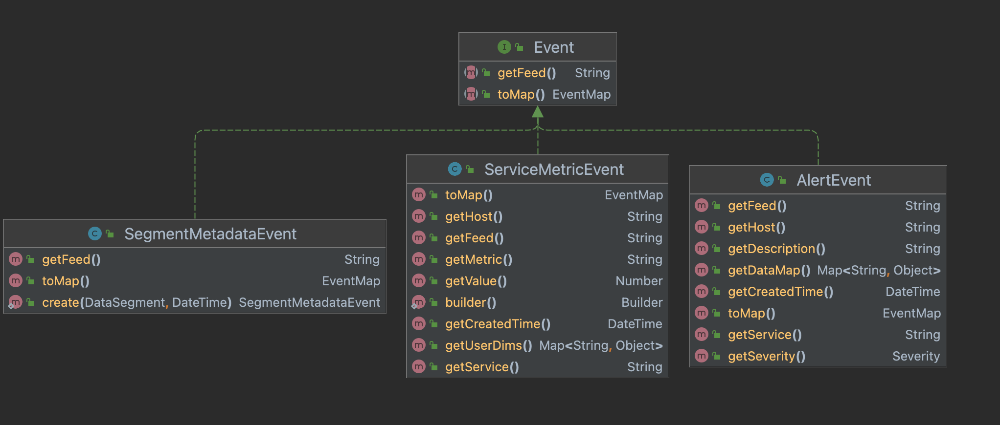
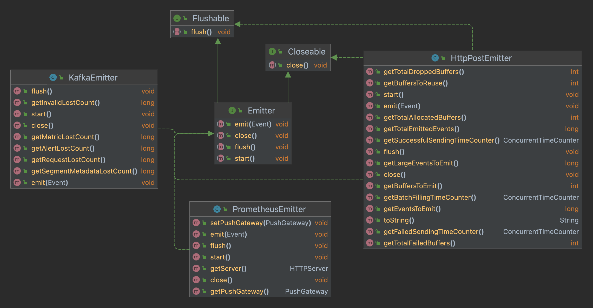
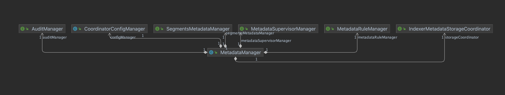
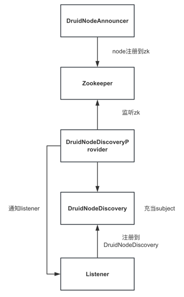
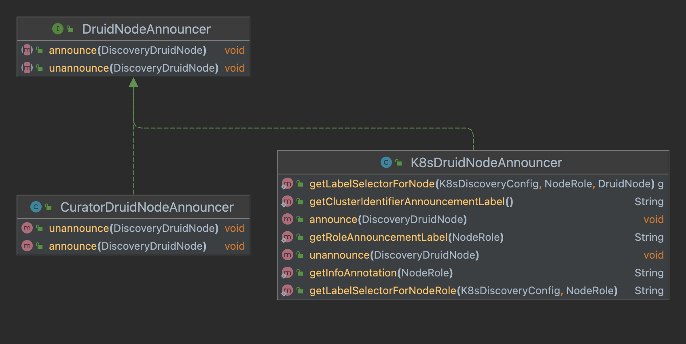
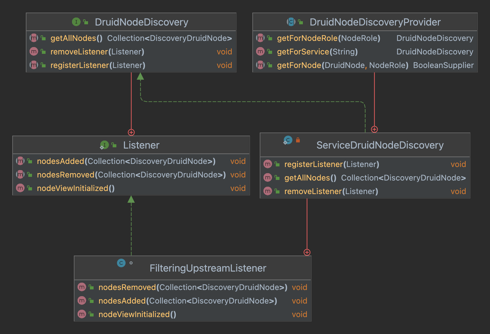
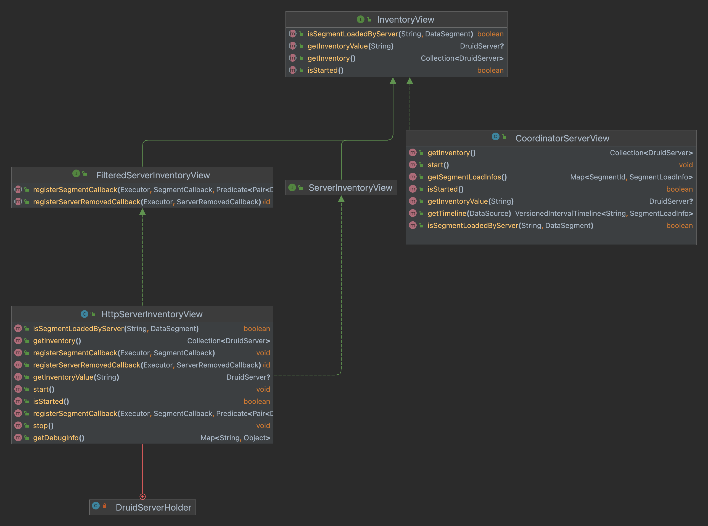
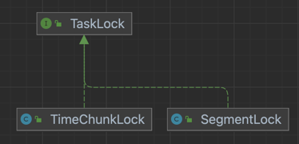
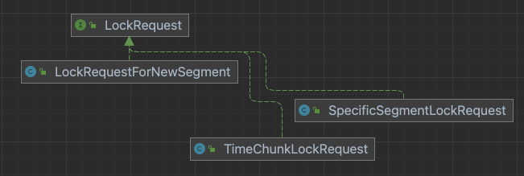

# Service启动

用 `Airline` 解析命令行参数映射到对应的 `Runnable`，调用 `run()` 启动服务。

```java
public class Main
{
  public static void main(String[] args)
  {
    //解析命令行
    final Runnable command = cli.parse(args);
    if (!(command instanceof Help)) {
      //注入command对象
      injector.injectMembers(command);
    }
    //启动进程
    command.run();
  }
}
```


服务启动使用了模板方法模式。服务的启动：

```java
public abstract class ServerRunnable extends GuiceRunnable
{
  @Override
  public void run()
  {
    final Injector injector = makeInjector(getNodeRoles(getProperties()));
    final Lifecycle lifecycle = initLifecycle(injector);

    try {
      lifecycle.join();
    }
    catch (Exception e) {
      throw new RuntimeException(e);
    }
  }
}
```

# Service生命周期管理

`Lifecycle` 管理服务的生命周期，有4个阶段：

- `INIT`：初始化 `log4j`；
- `NORMAL`：完成大部分对象的初始化；
- `SERVER`：完成服务器对象初始化，如 `jetty`；
- `ANNOUNCEMENTS`：通知集群该服务可用。

```java
public class Lifecycle
{ 
  public enum Stage
  {
    INIT,  //专门用于log4j的初始化
    NORMAL, //对大部分对象的配置，如zkClient，MetadataConnector的初始化
    SERVER, //适用于所有服务器对象
    ANNOUNCEMENTS //向集群宣告
  }
  
  private enum State
  {
    NOT_STARTED, //start()调用前
    RUNNING,  //start()调用后，stop()调用前
    STOP  //stop()调用后
  }
  
  //主要在NORMAL阶段，初始化其他对象
  public interface Handler
  {
    void start() throws Exception;

    void stop();
  }
  
  //大部分对象，如zkClient，MetadataConnector注入时调用此方法，在NORMAL阶段调用，添加handler
  public void addHandler(Handler handler, Stage stage)
  {
    if (!startStopLock.tryLock()) {
      throw new ISE("Cannot add a handler in the process of Lifecycle starting or stopping");
    }
    try {
      if (!state.get().equals(State.NOT_STARTED)) {
        throw new ISE("Cannot add a handler after the Lifecycle has started, it doesn't work that way.");
      }
      handlers.get(stage).add(handler);
    }
    finally {
      startStopLock.unlock();
    }
  }
  
  public void join() throws InterruptedException
  {
    ensureShutdownHook();
    //等待当前线程终止，join，控制线程的执行顺序
    Thread.currentThread().join();
  }
  
  public void start() throws Exception
  {
    startStopLock.lock();
    try {
      //不等于NOT_STARTED，可能已经RUNNING或者停止
      if (!state.get().equals(State.NOT_STARTED)) {
        throw new ISE("Already started");
      }
      //等于NOT_STARTED，再判断一次是否有其他线程启动，若还是NOT_STARTED，置为RUNNING
      if (!state.compareAndSet(State.NOT_STARTED, State.RUNNING)) {
        throw new ISE("stop() is called concurrently with start()");
      }
      for (Map.Entry<Stage, ? extends List<Handler>> e : handlers.entrySet()) {
        currStage = e.getKey();
        log.info("Starting lifecycle [%s] stage [%s]", name, currStage.name());
        for (Handler handler : e.getValue()) {
          handler.start();
        }
      }
      log.info("Successfully started lifecycle [%s]", name);
    }
    finally {
      startStopLock.unlock();
    }
  }
}
```

# Emitter

对事件的抽象：



对 `emitter` 的抽象：



发出一个事件，方法不能被阻塞或抛异常。如果 `Emitter` 的实现收到太多的事件，内部队列已满，应该丢弃事件；如果收到无效的输入，应该打印警告日志而不能抛异常；对警告日志应该加限制，避免日志过多。

# 元数据管理



`MetadataManager` 封装所有元数据管理类：

- `CoordinatorConfigManager`：

# 节点间的服务通信




## 服务注册



服务注册用 `DruidNodeAnnouncer` 实现，服务启动会将信息保留在 `/druid/internal-discovery/NodeRole` 目录下，若用 `Zookeeper` 做协调者。

## 服务发现



`DruidNodeDiscovery` 为主题，`DruidNodeDiscovery.Listener` 为观察者，用于服务发现。`ServiceDruidNodeDiscovery` 实现主题，维护 `listeners`。`FilteringUpstreamListener` 实现观察者，按服务类型过滤。

## InventoryView



`InventoryView` 用于查看服务的状态，及各个服务上的段分布。

# Overlord

`Overlord` 启动过程中，会初始化 `SegmentAllocationQueue`，在 `SERVER` 状态之前。选举成为 `leader` 后，`HttpRemoteTaskRunner` 启动。

`TaskMaster` 封装了 `Overlord` 的生命周期，收集任务的统计信息。

# Segment

## 版本系统

`Druid` 里，数据段和间隔紧密耦合。

`DataSegment`：数据段的元数据，不可变对象。

`Overshadowable` 

`SegmentId`，`DataSegment` 的标识符。此类必须针对常驻内存占用进行优化，因为段数据在 `Broker` 和 `Coordinator` 消耗了很多堆内存。

# Ingestion

## 任务创建

提交任务：

1. 调用 `TaskQueue` 的 `add(Task task)` 提交任务，设置任务的 `context`，将任务插入 `TaskStorage`；
2. 更新 `TaskQueue` 的 `tasks`，和 `TaskLockbox` 的 `activeTasks`；
3. `TaskQueue` 每次轮询，遍历从 `TaskRunner` 获取的 `tasks`，如果任务就绪，调用 `TaskRunner` 的 `run(Task task)` 运行任务，否则释放该任务持有的所有锁，如果任务处于 `pending` 状态，同样尝试调用 `TaskRunner` 的 `run(Task task)` 运行任务；
4. `TaskRunner` 更新 `tasks` 和 `pendingTaskIds`，任务先置为 `pending` 状态；
5. `TaskRunner` 有线程池定期处理 `pending` 的任务，遍历 `pendingTaskIds`，按照设置的策略寻找 `worker` 调度；
6. 向 `worker` 发送请求创建任务

`worker` 创建任务

### WorkerTaskManager

管理分配到 `worker` 上的任务，初始化流程：

1. 创建初始化任务的 `tmp` 目录 `baseTaskDir/workerTaskManagerTmp`；
2. 注册 `TaskRunner` 的 `listener`，获取当前已知任务的状态；
3. 恢复上次运行的任务，更新内存，注册 `feature`；
4. 初始化分配的任务，创建 `assignedTaskDir`，启动 `peon` 执行任务，发布任务到 `zk`，等任务分配成功，删除 `assignedTaskDir`；
5. 从 `completedTaskDir` 获取已完成的任务，加载进内存；
6. 启动线程定期清理已完成的任务，发布任务已完成的消息到 `zk`，删除已完成任务的目录。

`peon` 启动任务，会为任务选择 `slot`，执行指令启动新的 `jvm`。每个 `slot` 使用的处理器个数，会用物理机可用的处理器个数除以配置的 `slot` 总数计算。每个 `slot` 有一个目录，以循环的方式选择 `slot`，选择一个没有在使用的 `slot`。

任务启动后，会将日志写到临时目录，如果配置了将日志存到 `deepStorage`，任务完成后将日志和 `report.json` 写到 `deepStorage`。删除任务的目录。

`ExecutorLifecycle` 封装了任务的生命周期，启动后创建 `task.json` 和 `status.json`。为避免同一个任务创建两次，锁定文件。监控父进程，若父进程退出，终止当前进程。

`SingleTaskBackgroundRunner` 用单个线程池执行任务，是任务真正开始执行的入口。

`SeekableStreamIndexTaskRunner`，对任务运行逻辑的抽象。运行流程：

- 任务状态置为 `STARTING`，初始化工具类；

- 宣布 `PEON` 的存在，创建段，宣布段的存在到路径 `/druid/segments`。

- 初始化序列，反系列化 `checkpoints`。先尝试从 `sequences.json` 恢复，如果恢复失败，从 `context` 获取 `checkpoints`，获取不到 `checkpoints`，从 `ioConfig` 取每个分区的偏移量作为第一个版本。此过程得到每个版本每个分区的偏移量，结果是初始化成员变量 `sequences`

  ```java
  private volatile CopyOnWriteArrayList<SequenceMetadata<PartitionIdType, SequenceOffsetType>> sequences;
  ```

- 初始化 `currOffsets`，如果有持久化的元数据，直接赋值给 `currOffsets`，没有则取 `sequences` 

  ```java
  private final ConcurrentMap<PartitionIdType, SequenceOffsetType> currOffsets = new ConcurrentHashMap<>();
  ```

- 如果所有分区均以消费到 `endOffsets`，添加序列到 `publishingSequences`。持久化到目前为止摄取的所有数据。

- 分配分区，消费者根据 `currOffsets` 定位到每个分区的偏移量。

- 摄取状态更新为 `BUILD_SEGMENTS`，任务状态更新为 `READING`，进入循环，循环终止条件是分配的分区个数为0。

- 每次循环，检查是否处理过暂停请求，暂停时检查分区分配是否变化。

- 如果任务收到终止请求或者 `setEndOffsets` 被调用，序列消费结束，状态变为 `PUBLISHING`。

- 收到终止请求，退出循环。

- 所有分区都消费到了 `endOffsets`，开始 `publish`。`publish` 完成注册 `handoff`。

摄取任务的运行逻辑抽象：`SeekableStreamIndexTaskRunner`。一个任务生命周期的状态：

```java
public enum Status
{
  NOT_STARTED,
  STARTING,
  READING,
  PAUSED,
  PUBLISHING
}
```

`IOConfig`，决定如何从数据源获取数据。

`endOffsets`：`Map<PartitionId, Offset>`，存储每个分区停止读的偏移量。

`lastReadOffsets`：`Map<PartitionId, Offset>`，最近读过的每个分区的偏移量。

`currOffsets`：`Map<PartitionId, Offset>`，每个分区的起始偏移量。

`lastPersistedOffsets`：`Map<PartitionId, Offset>`，最近持久化的偏移量。

`publishingSequences`：`Set<String>`，正在发布的序列。

`sequences`：`CopyOnWriteArrayList<SequenceMetadata<PartitionIdType, SequenceOffsetType>>`，最近几次的 `checkpoint` 。

任务进入执行逻辑后，状态变为 `STARTING`。任务消费数据，需要知道从哪个数据源消费，对于流式摄取需要知道消费哪些分区，从哪个偏移量开始消费。任务首先初始化序列，该过程是对 `sequences` 做初始化。

先尝试恢复上次保存的序列文件 `sequences.json`。如果恢复失败，从 `context` 里反序列化。`context` 里没有，即 `supervisor` 是首次消费，从 `IOConfig` 获取。`context` 里的偏移量是自己维护的，`IOConfig` 是从 `Kafka` 获取的。

初始化消费者，`RecordSupplier` 是对不同数据源消费者对包装。

初始化 `currOffsets`，该任务要消费的分区起始偏移量。先查看本地是否有持久化的段，恢复提交的元数据，赋值给 `currOffsets`。如果没有持久化的元数据，取 `sequences` 的最老版本赋值给 `currOffsets`。至此，任务消费的序列信息已经初始化完毕。

下一步，开始消费数据。摄取状态变更为 `BUILD_SEGMENTS`，任务状态变为 `READING`，开始消费数据，终止条件是分配的分区个数为0。

使用 `RecordSupplier` 从数据源拉取数据， `Appenderator` 添加记录，每读一条记录，更新 `lastReadOffsets` 和 `currOffsets`。

如果该记录加进来之后该段的数据条数超过阈值，另起一个新段，或者内存中的数据总条数大于阈值，将数据持久化到磁盘。此时会对元数据做一次 `checkpoint`，先暂停读取数据，发送 `checkpoint` 请求，记录此时读取到的各个分区的偏移量。

收到暂停请求，任务状态变为 `PAUSED`，会一直阻塞等待唤醒。

每次循环，比较 `currOffsets` 和 `sequences`，看是否达到了 `endOffsets`。如果分配的所有分区都消费到了 `endOffset`，会触发推送数据，创建 `publishFuture` 和 `handoffFuture`。`publishFuture` 完成，`sequences` 会删除对应的序列。等待 `coordinator` 加载完所有的段，任务完成。

 `sequences` 的最新序列调用了 `setEndOffsets`，`assignment` 为空，状态变为 `PUBLISHING`，退出循环，摄取状态为 `COMPLETED`。


`Appenderator`，管理一些内存和磁盘数据，可提供查询服务，将数据推到深度存储，但不决定数据进入哪些段，不更新元数据。

`persistExecutor`，持久化数据到磁盘，`maxPendingPersists` 控制线程数。`pushExecutor`，推送数据到深度存储。


## TaskQueue

重要数据结构：

```java
//<taskId, Task> 保存所有状态的任务
@GuardedBy("giant")
private final LinkedHashMap<String, Task> tasks = new LinkedHashMap<>();

//<taskId, Future>
@GuardedBy("giant")
private final Map<String, ListenableFuture<TaskStatus>> taskFutures = new HashMap<>();

//已经完成等待被清除的任务，不应该再被启动
@GuardedBy("giant")
private final Set<String> recentlyCompletedTasks = new HashSet<>();
```

任务生产者和 `TaskRunner` 交互的接口，`TaskQueue` 接受由 `add` 方法添加的任务，提交给 `TaskRunner` 执行。

初始化过程：

- 同步任务表，以元数据库的结果为准更新内存；
- 同步任务锁表，获取锁失败的任务组，其所有的任务标记失败，等待清除；
- 启动工作线程，每次工作遍历内存的任务，创建就绪的任务并运行，清除状态不一致的任务；
- 启动同步线程，每次工作更新元数据库；
- 失败的任务释放锁，更新到任务锁表。

添加给定任务：

- 检查任务表是否有该任务，已存在则抛出异常；
- 设置任务的 `context`；
- 插入该任务的信息到任务表，更新状态
- 更新该任务到内存。

工作线程每次运行：

- 恢复 `TaskRunner`；
- 同步 `TaskRunner` 的状态，如果任务就绪，运行任务

## TaskRunner

### HttpRemoteTaskRunner

用内部发现和http管理 `MiddleManager` 上的任务。

## TaskLock

锁和版本紧密耦合，保证摄取数据的正确性。数据可以被覆盖，覆盖仅适用于相同的数据段和相同的 `Datasource`，被覆盖的段不会被查询。每个段都有一个大版本和一个小版本，大版本是一个时间戳，小版本是一个数字。两个版本用于确定段之间的覆盖关系。

多个任务对相同的时间块生成段，段之间会互相覆盖导致不正确的结果。为解决该问题，任务会在创建段之前获取锁。锁分为时间块锁和段锁。如果任务申请到了时间块锁，数据会写到它生成的段，其他任务无法为这个时间块生成数据段，除非有比当前段更大的大版本，它们的小版本一直是0。

段锁是任务锁定一个独立的块，多个任务可同时为同一个时间块创建段。段锁创建的段有相同的大版本和不同的小版本。使用段锁需要在任务的 `context` 里设置 `forceTimeChunkLock` 为 `false`，否则任务会自动选择合适的锁类型。

抢占锁可发生在任何时候，除非任务在发布段。同一个 `groupId` 的任务共享锁。



同一个 `DataSource` 对锁冲突的检测：

- `TimeChunkLock`：时间间隔有重叠即有冲突；
- `SegmentLock`：如果是申请给新的段加锁，一定不冲突。间隔相同且分区ID相同则冲突，间隔不相同且有重叠则冲突。

对给定 `LockRequest`，检查锁是否能重用：

- 锁类型和锁粒度必须一致，否则不能重用；
- 锁类型 `REPLACE`、`APPEND`、`SHARED`，锁请求是时间间隔，锁的间隔包含请求间隔且锁的组ID等于请求的组ID才能重用；
- 锁类型 `EXCLUSIVE`，锁请求是时间间隔，锁的间隔包含请求间隔且锁的组ID等于请求的组ID才能重用；锁请求是段，锁间隔包含请求间隔且锁的组ID等于请求组ID且锁的分区ID等于请求的分区ID才能重用。

```java
boolean reusableFor(LockRequest request)
{
  if (taskLock.getType() == request.getType() && taskLock.getGranularity() == request.getGranularity()) {
    switch (taskLock.getType()) {
      case REPLACE:
      case APPEND:
      case SHARED:
        if (request instanceof TimeChunkLockRequest) {
          return taskLock.getInterval().contains(request.getInterval())
                 && taskLock.getGroupId().equals(request.getGroupId());
        }
        return false;
      case EXCLUSIVE:
        if (request instanceof TimeChunkLockRequest) {
          return taskLock.getInterval().contains(request.getInterval())
                 && taskLock.getGroupId().equals(request.getGroupId());
        } else if (request instanceof SpecificSegmentLockRequest) {
          final SegmentLock segmentLock = (SegmentLock) taskLock;
          final SpecificSegmentLockRequest specificSegmentLockRequest = (SpecificSegmentLockRequest) request;
          return segmentLock.getInterval().contains(specificSegmentLockRequest.getInterval())
                 && segmentLock.getGroupId().equals(specificSegmentLockRequest.getGroupId())
                 && specificSegmentLockRequest.getPartitionId() == segmentLock.getPartitionId();
        } else {
          throw new ISE("Unknown request type[%s]", request);
        }
        //noinspection SuspiciousIndentAfterControlStatement
      default:
        throw new ISE("Unknown lock type[%s]", taskLock.getType());
    }
  }

  return false;
}
```

### TaskLockType

追加型任务不能使用 `REPLACE` 锁，替换型任务只能用 `EXCLUSIVE` 或 `REPLACE` 锁，`REPLACE` 和 `APPENDED` 只能用于时间块锁。

```java
public enum TaskLockType
{
  //给定时间间隔内最多只能有一个独占锁，不能与有重叠间隔的锁共存
  EXCLUSIVE,
  
  //给定时间间隔内可有多个共享锁，不能与其他共享锁共存，不能与其他类型的锁共存
  SHARED,

  //给定时间间隔最多有一个替换锁，只能与间隔包含在内的追加锁共存，具有重叠间隔的其他类型锁无法兼容
  REPLACE,

  //给定时间间隔可有任意的追加锁，可与其他追加锁共存，最多与一个替换锁共存，且间隔要包含追加锁的间隔
  APPEND
}
```

### LockRequest



对每种类型的锁获取锁的元数据方法进行抽象：

- `TimeChunkLockRequest`：对应时间块锁，可以被撤销；
- `SpecificSegmentLockRequest`：对应段锁，可以被撤销，有 `partitionId`；
- `LockRequestForNewSegment`：可以是段锁或时间块锁，对应要锁定新段的锁，有 `sequenceName`，会生成段ID。

### TaskLockBox


记录活跃的任务锁定了哪些间隔和哪些段，内存和元数据库各维护一份锁的记录，内存的数据结构：

```java
//<Datasource, <startTime, <Interval, List<Tas+TaskLock>>>
private final Map<String, NavigableMap<DateTime, SortedMap<Interval, List<TaskLockPosse>>>> running = new HashMap<>();

//taskId
private final Set<String> activeTasks = new HashSet<>();
```

同步元数据库，只发生在 `TaskQueue` 启动初始化：

1. 从数据库找出活跃的任务及持有的锁，按照任务的版本升序排序；

2. 清空 `running` 和 `activeTasks`，`activeTasks` 更新为步骤1查询的结果；

3. 遍历步骤1的结果，过滤掉间隔异常的任务和锁，检查任务和锁的优先级、`dataSource`、`groupId` 是否匹配；

4. 根据锁的粒度生成 `LockRequest`，检查是否有锁可重用，若没有可重用的锁：

   1. 锁类型为 `APPEND` 或 `REPLACE`，且锁粒度为段；
   2. 锁请求与冲突的锁不能共存；
   3. 撤销所有不兼容的锁失败；

   符合以上其中一个条件，任务的组ID标记失败，等待后续杀死任务。
