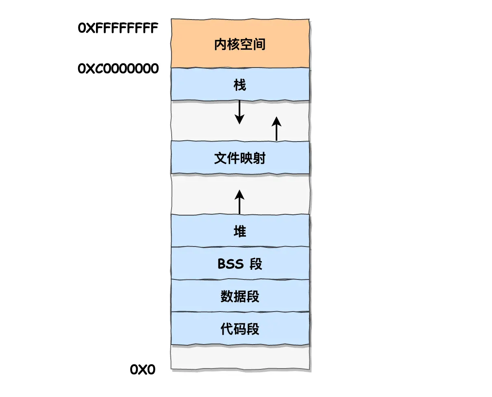
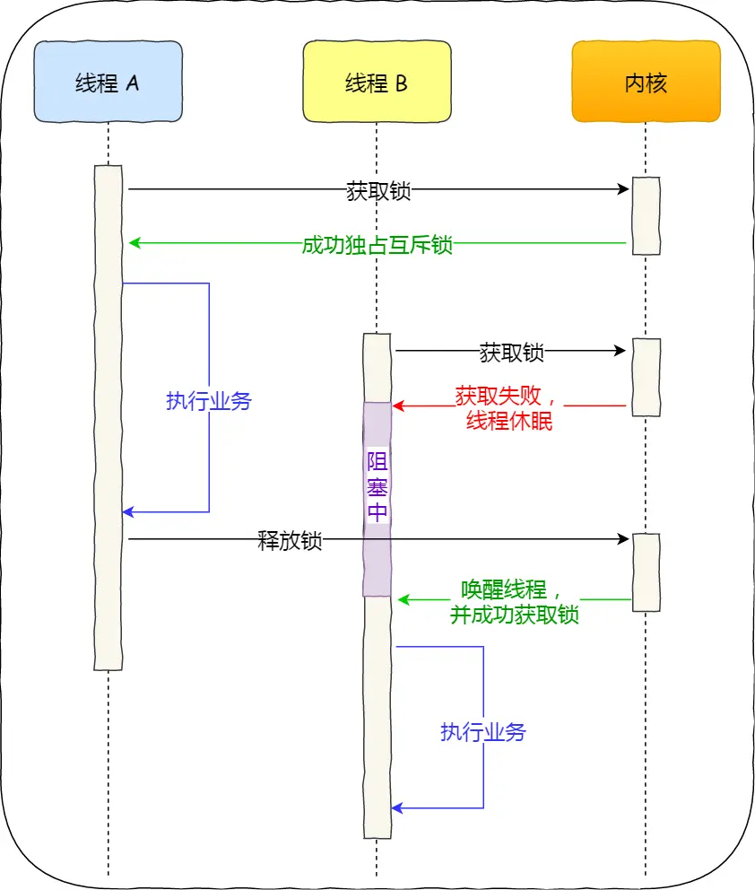

# 结构组成

计算机基本结构：运算器、控制器、存储器、输入设备、输出设备。内存是存储器，`CPU` 包含运算器、控制器、寄存器，输入输出设备是外界设备，内存和外设通过控制总线与 `CPU` 交互。

存储数据的基本单位是字节，1字节是8位，内存地址从0到总字节数减1。32位和64位 `CPU` 表示一次能计算多少字节数据。

控制器控制 `CPU` 工作， 是读写数据还是执行计算，运算器负责计算，寄存器存放计算时数据。寄存器分为：通用寄存器，存放要计算的数据；程序计数器，存储要执行的下条指令地址；指令寄存器，存放当前执行的指令。

总线分为：地址总线，指定 `CPU` 要操作的内存地址；数据总线，传输数据；控制总线，发送接收信号，如中断。

`CPU` 执行过程：读取程序计数器，控制器通过地址总线指定地址，通知内存准备数据，数据准备好后通过数据总线给 `CPU`，`CPU` 收到放入指令寄存器。程序计数器自增，指向下一条指令。`CPU` 分析指令确定类型，计算指令给运算器，存储指令给控制器。

程序运行时，内存中数据和代码分开存放，存放数据的区域是数据段，存放代码的区域是正文段。

寄存器存放 `CPU` 正在处理的数据，速度最快，存储数据量较少；三层 `Cache` 为 `CPU` 高速缓存，速度相比寄存器慢些，存储的数据多些，`L1` 缓存分成数据缓存和指令缓存，离 `CPU` 最近，`L1` 和 `L2` 缓存是每个 `CPU` 独有的，`L3` 是多个 `CPU` 共享的。若一个线程在不同的 `CPU` 来回切换，会影响缓存命中率，对多个计算密集型线程，可把线程绑定到固定 `CPU` 上。

`CPU` 访问数据，先取寄存器，再取三层 `Cache`，最后取内存。`CPU` 不会和每一种存储器直接交互，每种存储器只和相邻的存储器交互。如 `CPU Cache` 从内存加载数据，写回数据也只写回内存，不会把数据写到硬盘。

# 中断

中断是系统响应硬件设备请求的一种机制，操作系统收到硬件的中断请求，会打断正在执行的进程，调用内核的中断处理程序响应请求。中断请求的是响应程序，要尽快完成避免影响进程调度。若当前中断处理未完成，其他中断请求无法响应，可能会丢失。

为解决中断处理过长和中断丢失，将中断分成两部分：上半部分为硬中断，会中断处理程序，直接处理硬件请求，负责耗时短的工作，快速执行；下半部分为软中断，由内核线程执行，负责上半部分未完成的工作，延迟执行，通常耗时较长。

操作系统的基本能力：进程调度，进程/线程管理，决定使用哪个 `CPU`；内存管理，决定内存分配回收；硬件设备管理，让进程和硬件设备通信；提供系统调用，即操作系统和用户程序间的接口。

# 内存管理

内存分为内核空间和用户空间，进程通过系统调用进入内核空间，触发中断进入内核态，内核处理完，主动触发中断回到用户态。

操作系统将不同进程的虚拟地址和不同内存的物理地址映射起来，虚拟地址通过 `CPU` 中的内存管理单元映射成物理地址访问。时间局部性，某条指令被执行，不久后可能再次被执行，某块数据被访问，不久后可能再次被访问。空间局部性，一旦访问某个存储单元，不久后附近的存储单元也会被访问。局部性原理是实现虚拟内存的关键。

分段管理，程序由不同分段组成：代码、数据、栈和堆。段表维护虚拟地址和物理地址的映射，找到段基地址加上偏移量就是物理地址。每个段长度不固定，易产生外部碎片，将占用的内存写到 `Swap` 空间，读回内存重新分配可解决碎片问题，若段较大，和磁盘交换的效率会低。

分页管理，把内存切成固定大小的页，用页表维护虚拟地址和物理地址映射。程序不足一页大小，只能分配一页，易会产生内部碎片。内存不足时，可将最近未使用的页交换到磁盘，需要时再换入到内存，因页比较小，交换效率提升。分页不用一次将程序加载到内存，需要使用时加载即可。页表一定要覆盖所有虚拟地址，维护页表需要较大的空间。可用多级页表解决，利用了局部性原理，一级页表未使用的地址不会分配到二级页表。页表缓存 `TLB`，存放最常访问的页表项。

进程有独立的虚拟内存，虚拟内存的内核地址是相同的，便于切换到内核态。




`malloc()` 分配的是虚拟内存，分配后的虚拟内存未被访问，不映射到物理内存。分配内存较小用 `brk()` ；较大用 `mmap()`。`brk()`，移动堆顶指针获得新的内存空间，`free()` 后会缓存待下次使用；`mmap()`，在文件映射区分配内存，`free()` 后归还给操作系统。

进程申请到的是虚拟内存，当读写该虚拟内存，发现没有映射到物理内存，`CPU` 产生缺页中断切换到内核态分配物理内存。内存不足时，操作系统会回收，可回收的内存：文件页，干净页直接释放，脏页先写磁盘再释放；匿名页，不常访问的页交换到磁盘。若回收后内存仍不够，触发 `OOM` 有选择性杀死进程。

内存回收基于 `LRU`，导致缓存命中率下降：预读失效和缓存污染。

进程读取文件，`Linux` 将内容缓存在 `PageCache`。为减少 `IO` 提高吞吐量，`PageCache` 的预读机制会将目标页及相邻的页一起读进内存。若提前加载的页未访问，预读失效，可能淘汰掉热点数据，降低缓存命中率。改进方法：实现两个 `LRU` 链表，活跃链表存放最近被访问过的页，非活跃链表存放很少被访问的页，预读页加入到非活跃链表头部，真正被访问时才插入到活跃链表头部，若预读页一直未被访问，从非活跃链表移除，活跃链表中的页降级先加入到非活跃链表。

设计思路都是将数据分成冷热数据，分别使用 `LRU`。

划分区域可避免预读失效，但存在缓存污染问题。批量读取数据，被访问一次就加到活跃链表，若这批数据在之后很长时间都不被访问，真正的热点数据被淘汰，活跃链表会被污染。解决缓存污染，提高进入活跃链表的门槛，让热点数据不被轻易替换。`Linux` 第二次访问页时，才将页从非活跃链表加入活跃链表。`InnoDB` 第二次访问页时，若和第一次的访问间隔在1s内，不升级；若访问间隔超过1s，将页从 `old` 区域升级到 `young`。通过提高进入活跃链表的门槛，避免缓存污染的影响。

# 进程管理

进程三种基本状态：运行，进程占用 `CPU`；就绪，可运行，等待 `CPU`；阻塞，进程等待某事件停止运行。

有大量阻塞进程会占用物理内存，通常把阻塞进程的物理内存空间换出到磁盘，进程没有占用物理内存的状态为挂起。进程挂起的情况：物理内存不足；`sleep` 让进程挂起。

进程控制块 `PCB` 描述进程，是进程的唯一标识，包括进程描述信息、资源分配、`CPU` 相关信息。`PCB` 通过链表组织在一起，相同状态的进程组成一个队列，根据进程状态分为阻塞队列、就绪队列。

创建进程，创建 `PCB`，为进程分配运行时的资源，将 `PCB` 插入到就绪队列等待被调度，允许一个进程创建另一个进程，子进程可继承父进程的资源，子进程终止，资源还给父进程，父进程终止，子进程变成僵尸进程，占用进程表空间。子进程继承父进程的环境变量、工作目录、用户和组、进程优先级和内存映射。

写时复制，子进程共享父进程的物理内存数据，权限是只读。当父进程或子进程写内存，`CPU` 触发保护中断复制物理内存，重新设置内存映射关系，权限设为可写再进行写操作。发生写操作时，才会复制物理内存，防止复制内存时间过长导致父进程阻塞。

阻塞进程，调用阻塞语句阻塞等待，只能由另一个进程唤醒。若为运行状态，保存上下文，`PCB` 插入阻塞队列。唤醒线程，`PCB` 从阻塞队列移出，插入到就绪队列等待调度。

进程上下文切换，保存好当前进程的 `CPU` 寄存器和程序计数器，切换到另一个进程。进程是内核管理的，进程切换只发生在内核态。上下文切换的场景：分配时间片耗尽，变为就绪状态；系统资源不足，进程被挂起； `sleep` 主动挂起；硬件中断阻塞。

线程，可并发运行共享相同的地址空间，是进程中的一条执行流程。

进程是资源分配的基本单位；线程是 `CPU` 调度的基本单位，只独享寄存器和栈，减少并发执行的时间和空间开销，因共享资源，传输数据不需要经过内核，创建终止时间快，切换快。操作系统的任务调度对象是线程，进程只是给线程提供了虚拟内存、全局变量资源。两个线程属于不同进程，上下文切换和进程一样，属于同一进程，因资源共享，只需切换线程私有数据，开销小很多。进程从运行状态变化到另一状态，会触发一次调度。

# 进程调度

调度算法指标：`CPU` 利用率，确保 `CPU` 是始终匆忙状态；吞吐量，表示单位时间内 `CPU` 完成进程数量，短作业优先可提升；周转时间，进程运行+阻塞时间+等待时间；等待时间，处于就绪队列的时间；响应时间，用户提交请求到响应花费的时间，交互式系统关注。

常见调度算法：先来先服务，适用 `CPU` 繁忙，不适用 `IO` 繁忙；短作业优先，有助于提高吞吐量；高响应比优先，根据要求服务时间计算响应比优先级，选最高的运行；时间片轮转，每个进程运行的时间片一致，时间片太大影响响应时间，时间片太小上下文切换开销大；多级反馈队列，每个队列优先级从高到低，优先级越高时间片越短，新进程加入第一级队列等待调度，在时间片内没完成加入到下一级队列，高优先级队列为空才执行低一级的队列，兼顾长短作业，有很好的响应时间，是时间片轮转和优先级算法的综合发展。

线程非法访问内存引起崩溃，进程也会崩溃，因为线程共享地址空间，对地址的非法访问造成内存的不确定性，可能影响到其他线程，操作系统通过信号机制让进程崩溃。`Java` 进程不会出现此情况，因为 `JVM` 启动后会设置信号处理函数，会将该错误拦截。

# 进程通信

进程地址空间是独立的，内核是共享的，进程间通信必须通过内核。

管道，将前一个命令的输出，作为后一个命令的输入，单向传输。该方式效率低，不适合进程间频繁交换数据，好处是简单。实际是内核的一串缓存。匿名管道只能父子进程间通信，随进程结束销毁。

```shell
ps -ef | grep mysql
```

消息队列是保存在内核中的消息链表，如果没有释放会一直存在。缺点是通信不及时，消息体大小有限制，不适合大数据传输，存在用户态和内核态间的数据拷贝开销。

共享内存，减少用户态和内核态之间的消息拷贝开销。拿出一块虚拟地址空间，映射到相同的物理内存给多个进程共享，但会产生同步问题，同一个地址被多个进程同时写。

信号量可防止进程竞争共享资源，提供了保护机制，使共享资源在任意时刻只被一个进程访问。实质是一个整型计数器，实现进程间的互斥和同步，不缓存进程间的通信数据。信号量表示资源数量，两种原子操作：`P` 操作，信号量减1，若小于0表示资源被占用，进程阻塞等待，大于0表示还有资源可用；`V` 操作，信号量加1，若不大于0表示有阻塞的进程，将其唤醒，若大于0表示没有阻塞的进程。`P` 操作在进入共享资源前执行，`V` 操作在离开共享资源后执行，必须成对出现。保证共享内存在任意时刻只有一个进程在访问。

信号是进程间唯一的异步通信方式，主要来源有硬件和 `kill` 命令。

 `Socket` 通信，不同主机的进程间通信。不仅可跨网络与不同主机的进程通信，还可以在同主机上进程间通信。

# 线程协作

临界区，操作共享变量的代码片段，可能导致竞争状态。临界区有正在执行的线程，其他线程应被阻止进入临界区。同步，线程互相等待通信；互斥，线程不能同时操作临界区。

线程协作实现通过锁和信号量，锁只能实现互斥，信号量还可实现同步。

## 锁

线程加锁成功后进入临界区，离开临界区后释放锁。两种实现：自旋锁，`CAS` 函数实现，`CAS(lock,0,pid)` 加锁，`CAS(lock,pid,0)` 解锁，获取不到锁时，线程等待不做任何事，在用户态完成加锁和解锁，不主动产生上下文切换。互斥锁，获取不到锁时让出 `CPU`，把当前线程加到锁等待队列。临界区执行时间很短，用自旋锁，否则用互斥锁。



读写锁用于明确区分读操作和写操作的场景，在读多写少的场景能发挥优势。写锁是独占锁，读锁是共享锁。有读优先锁和写优先锁，都会导致另一种操作饥饿，公平读写锁用队列将获取锁的线程排队，不会产生饥饿现象。

悲观锁认为线程同时修改共享资源的概率较高，易出现冲突，访问共享资源前要先上锁。乐观锁认为线程发生冲突的概率很低，先修改共享资源，再验证这段时间有没有冲突，若没有其他线程修改则完成，否则回滚放弃修改。乐观锁适用于冲突概率很低，加锁成本很高的场景，如在线文档编辑。

死锁，多个线程使用多个互斥锁，可能一直互相等待。产生死锁的条件：互斥，多个线程不能同时使用同一资源；持有并等待，线程等待其他资源时不会释放已经持有的资源；不可剥夺，线程持有的资源在释放前不能被其他线程获取；环路等待，线程获取资源的顺序形成环形链路。避免死锁发生，破坏其中一个条件。

死锁诊断，用 `jstack` 或 `pstack`，若某几个线程一直没有变化，且是在等待锁，大概率是死锁问题。

## 信号量

信号量协调共享资源的访问，表示资源数量，对应一个整型变量。对于两个线程，信号量为1，表示没有线程进入临界区；0，表示有一个线程进入临界区；-1，表示一个线程在临界区，另一个线程等待进入。

生产者-消费者问题，生产者生成数据放入缓冲区，消费者从缓冲区取数据，任何时刻只能有一个生产者或消费者访问缓冲区。只能有一个线程操作缓冲区；缓冲区空时，消费者需等待生产者，缓冲区满时，生产者需等待消费者取数据。用三个信号量实现：`mutex`，互斥访问缓冲区；`fullBuffers`，消费者询问缓冲区是否有数据；`emptyBuffers`，生产者询问缓冲区是否有空位。

# 文件系统

文件系统负责管理持久数据，`Linux` 一切皆文件，普通文件、目录、管道、`socket` 都交给文件系统管理。文件的数据结构：索引节点，记录文件的元信息，包括文件大小、访问权限、磁盘位置、修改时间等，占用磁盘空间；目录项，记录文件名、索引节点指针和其他目录项的层级关联关系，多个目录项形成目录结构，缓存在内存。一个文件可有多个别名，目录项和索引节点关系是多对一。

磁盘格式化时，会分成三个存储区域：超级块，存储文件系统详细信息；索引节点区，存储索引节点；数据块区，存储数据或目录。


硬链接，多个目录项的索引节点指向一个文件，不能跨越文件系统，删除文件的所有硬链接及源文件，系统才会彻底删除该文件。软链接相当于重新创建一个文件，有独立的索引节点，文件内容是另一个文件的路径，相当于访问到另一个文件，可以跨文件系统，目标文件删除软链接仍然存在，只是找不到指向的文件。

# IO

按是否使用标准库缓冲划分：缓冲 `IO`，用标准库缓存实现文件的加速访问，标准库通过系统调用访问文件，很多程序遇到换行才输出，换行前的内容被标准库暂时缓存，减少系统调用次数；非缓冲 `IO`，直接通过系统调用访问文件。

按是否使用操作系统缓存划分：直接 `IO`，没有 `PageCache` 和用户空间的数据复制，数据由 `DMA`直接从磁盘到用户空间；非直接 `IO`，读操作时数据从内核缓存拷贝到用户程序，写操作时数据从用户程序拷贝到内核缓存，由内核决定什么时候写数据到磁盘。内核缓存落盘的时机：调用 `write()` 发现内核缓存数据过多；用户主动调用 `sync`；内存紧张无法分配页面；内核缓存数据超过缓存时间。

按是否阻塞划分：阻塞 `IO`，用户执行 `read()` 线程被阻塞，直到内核数据准备好并拷贝到用户区；非阻塞 `IO`，用户执行 `read()` 立即返回，此时不断轮询内核，内核准备好拷贝到用户区。

`IO` 多路复用，改进非阻塞 `IO`。对 `IO` 事件分类，内核数据准备好后以事件通知应用程序。大大改善 `CPU` 利用率，若无事件发生，当前线程会阻塞，`CPU` 切换到其他线程，事件到来再唤醒阻塞的线程。可在一个线程里同时处理多个 `socket` 请求。

阻塞 `IO`、非阻塞 `IO` 、非阻塞 `IO` 多路复用，从内核空间拷贝到用户空间都需要等待，都是同步调用。异步 `IO`，等待内核数据准备好和从内核拷贝数据到用户空间两个过程都不用等待，内核自动将数据拷贝到用户空间。

`IO` 分为两个过程：数据准备；数据从内核空间拷贝到用户空间。阻塞 `IO` 两个过程都会阻塞，非阻塞 `IO` 和基于非阻塞 `IO` 的多路复用只阻塞在数据拷贝，异步 `IO` 两个过程都不阻塞。

# PageCache

进程执行 `write()` 将文件写入 `PageCache`，内核会找合适时机把 `PageCache` 的数据持久化到磁盘。`fsync` 将数据立即持久化到磁盘。

页是内存分配的基本单位，匿名页是进程运行内存空间，文件备份页对应 `PageCache`，最大的问题是脏页回盘。直接 `IO` 读取数据不进入 `PageCache`。`PageCache` 缓存文件页，是逻辑层面与文件系统同级，`BufferCache` 缓存磁盘块，是物理层面与块设备驱动程序同级，共同目的都是加速数据 `IO`，写数据先写到缓存标记脏页，之后持久化到外部存储，读数据先读缓存，未命中读取存储加入到缓存，新版本内核将两者合并到一起。

`PageCache` 的内存回收代价较低，对应文件上的若干顺序块，顺序 `IO` 落盘，若没有写操作甚至不需要回盘。

`PageCache` 缓存文件的页数据，与文件系统同级；`BufferCache` 缓存磁盘的块数据，与块设备驱动程序同级，目的都是加速数据 `IO`。写数据先写到缓存，写入页标记为脏页，写回到外部存储；读数据时先读缓存，未命中再去外部存储读取。`BufferCache` 维护指向块指向页的指针，和 `PageCache` 融合在一起。

若写操作对应数据在 `PageCache` 中，直接作用于 `PageCache`。若数据还没刷新到磁盘，内存数据领先磁盘，对应的页为脏页。实现文件一致性：写穿，向用户层提供特定接口，主动调用接口保证文件一致性，牺牲了吞吐量，能保证数据不丢失；写回，内核线程定期同步脏页，若系统宕机数据会丢失。

`PageCache` 优势：加速数据访问，减少 `IO` 次数，提高磁盘 `IO` 吞吐量，将多个 `IO` 请求合并成一个请求磁盘。劣势：需要占用额外物理内存，物理内存紧张时会导致频繁的交换，使磁盘 `IO` 负载上升。

文件传输先加载数据到 `PageCahe`，后由 `DMA` 搬运。但传输大文件时，`PageCahe` 被迅速占满不起作用，多做一次拷贝到 `PageCache`。传输大文件，用异步 `IO` + 直接 `IO` 代替。

# 设备管理

为屏蔽设备间的差异，每个设备都有一个设备控制器，`CPU` 通过设备控制器和设备交互。设备控制器有状态寄存器、命令寄存器和数据寄存器。对磁盘和网卡这类传输数据量大的设备，`CPU` 写数据到控制器缓冲区，囤够一定数据才发给设备，减少对设备的频繁操作。

设备通过中断控制器完成任务后通知 `CPU`。但中断对磁盘这种频繁读写的设备不友好，`CPU` 会经常被打断。`DMA`，直接内存访问，使设备在 `CPU` 不参与的情况，自行将设备数据放入内存。

# 网络系统

网络性能指标：带宽，链路的最大传输速率；延时，数据包发送到响应需要的时间延迟；吞吐率，单位事件内传输的数据量；`PPS`，以网络包为单位的传输速率，包/秒；网络可用性；并发连接数；丢包率；重传率。

## 零拷贝

`DMA`，直接内存访问，在 `IO` 设备和内存的数据传输时，数据搬运全部交给 `DMA`，`CPU` 只负责和 `DMA` 交互把数据从内核缓冲区拷贝到用户缓冲区。

零拷贝，减少上下文切换和数据拷贝次数，追求不通过 `CPU`，只通过 `DMA` 传输数据，传输过程不能有数据处理。

`read()` + `write()`：`DMA` 拷贝磁盘数据到内核缓冲区，`CPU` 拷贝到用户缓冲区，再到 `socket` 缓冲区，`DMA` 拷贝到网卡缓冲区。需要有多次上下文切换，因用户空间不需要加工数据，拷贝到用户缓冲区没有必要。

`mmap()` + `write()`：`mmap` 拷贝数据到内核缓冲区，并映射到用户空间，用户空间不需拷贝能直接访问。`write()` 拷贝到 `socket` 缓冲区，最后 `DMA` 拷贝到网卡，减少了一次数据拷贝。

`sendfile()`：将数据从内核缓冲区拷贝到 `socket` 缓冲区，甚至 `SG-DMA` 直接从内核缓冲区拷贝到网卡。

## Socket

应用程序发送数据，通过 `socket` 接口发生系统调用，拷贝数据到内核 `socket` 缓冲区，由网络协议栈逐层解析，从网卡发送。

跨主机的进程通信，要各自创建一个 `socket`，可指定传输层使用 `TCP` 还是 `UDP`，网络层使用 `IPv6` 还是 `IPv4`。`socket` 为应用层使用传输层提供一个接口，`socket()` 指定网络协议和传输协议，`bind()` 给 `socket` 绑定 `IP` 地址和端口，确定传递的应用程序和网卡。内核为每个 `socket` 维护两个队列，一个存放还没完全建立的连接，另一个存放已经建立的连接。

`TCP` 连接由四元组唯一确认：本机 `IP`，本机端口，对端 `IP`，对端端口。服务器处理连接数限制：`socket` 实际是一个文件，对应一个文件描述符，单进程打开的文件描述符是有限的；每个 `TCP` 连接在内核中有对应的数据结构，会占用一定内存。

多进程模型，最原始的阻塞网络 `IO`，为每个客户端分配一个进程处理请求。服务器主进程监听客户端连接，连接完成 `fork()` 创建一个子进程处理，父进程监听 `socket`，子进程处理已连接 `socket`。

多线程模型，服务器与客户端完成 `TCP` 连接后，创建线程，传递给线程已连接 `socket` 的文件描述符。

`IO` 多路复用，用一个进程维护多个 `socket`，思想类似单 `CPU` 并发多个进程。通过 `select/poll/epoll` 系统调用从内核获取事件。将所有连接的文件描述符传给内核，内核返回产生事件的连接，用户态处理对应的请求。`epoll` 使用红黑树性能最好。

## Reactor

`NIO`：`Buffer` 负责数据存储；`Channel` 负责数据传输读写；`Selector`：实现多路复用，允许一个线程管理多个 `Channel` 事件。

服务器处理多个客户端，最直接的方式是为每条连接创建线程。连接关闭后线程要销毁，会带来性能开销和资源浪费。用资源复用解决该问题，创建线程池，一个线程处理多个连接。但如果没有数据可读，发生阻塞，线程无法处理其他连接。把 `socket` 改成非阻塞，线程不断轮询判断是否有数据，但是太消耗 `CPU`。`IO` 多路复用，用系统调用监听连接，把关心的连接传给内核，由内核检测。没有事件发生，线程阻塞在系统调用；有事件发生，内核返回事件连接，从阻塞状态返回，用户态处理连接。

`Reactor` 模式，对事件反应，来一个事件就有相对应的反应，非阻塞同步网络模式。又叫 `Dispatcher`，收到事件，根据事件类型分给某个进程/线程。由处理资源池和 `Reactor` 组成：`Reactor` 负责监听和分发事件，类型包括连接和读写，可有多个；处理资源池负责处理事件，可是单/多进程/线程。

感知的事就绪可读写事件，每次感知到事件发生，进程主动调用 `read()` 获取数据，该过程同步。

单 `Reactor` 单线程/进程，`Reactor` 通过 `IO` 多路复用监听事件，根据事件类型分发，连接建立给 `Acceptor`，处理事件给 `Handler`。全部在同一个进程完成，设计简单，但不能利用多核 `CPU` 的优势，`Handler` 处理事件时，无法处理其他连接建立事件，若处理事件过长，会造成响应延迟，不适用计算密集型场景。`Redis` 处理业务在内存完成，性能瓶颈不在 `CPU`，使用的该模式。

单 `Reactor` 多线程/进程，`Handler` 不再处理业务，只负责数据接收发送，交给子线程的 `Processor` 处理业务，处理完返回 `Handler` 发送给客户端。能充分利用多核 `CPU`，单涉及共享资源的竞争。一个 `Reactor` 承担所有事件监听，高并发场景易成为性能瓶颈。

多 `Reactor` 多线程/进程，`MainReactor` 通过 `IO` 多路复用监听连接建立事件，将连接分配给子线程，子线程 `SubReactor` 继续监听分配的连接，创建 `Handler` 处理连接的响应事件。主线程和子线程分工明确，主线程只负责接收新连接，子线程只负责处理。`Netty` 基于该模式实现。

## Proactor

`Proactor`，异步网络模式。感知的是已完成的读写事件，数据从内核到用户空间全部由内核完成，进程不需要等待。

可惜 `Linux` 的异步 `IO` 不完善，主要还是用 `Reactor` 网络模式。

# Linux

分析日志用 `ls -lh` 先查看大小，慎用 `cat` 而用 `less`。分析日志 `PV`，`wc -l xx.log`，分组分析 `awk '{print $4}' xx.log`。

```shell
awk '{print substr($4, 2, 11)}' xx.log | sort | uniq -c
```

统计 `UV`

```shell
awk '{print $1}' xx.log | sort | uniq -c | wc -l
```

# 补充

内核态下 `CPU` 可访问所有指令和硬件资源，用户态下 `CPU` 只能执行部分指令集，不能访问硬件资源，运行用户程序，保证操作系统的安全性、稳定性和易维护性。

协程是一种用户态的轻量级线程，完全由用户程序调度，不需要内核参与，切换开销很小，不需要切换到内核态，但编程更复杂。

进程是分配资源的基本单位，资源有虚拟内存、信号量、文件句柄。

进程切换包括虚拟内存、全局变量、文件描述符，需要进入内核态，`CPU` 的页表指针需要指向新的进程页表；线程切换只涉及寄存器、栈和程序计数器

堆是动态分配内存，存储对象；栈是静态分配内存，由编译器自动分配和释放，存储函数局部变量和调用信息。
